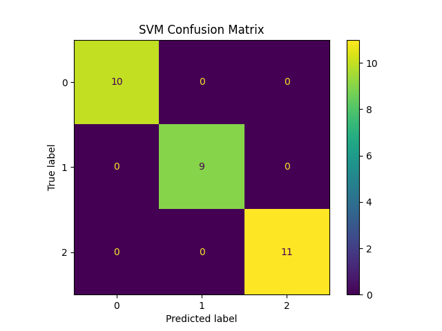

# MLOps Assignment 1

## 📌 Problem Statement
The objective of this assignment is to:
- Train and compare multiple ML models.
- Use MLflow for experiment tracking and logging.
- Monitor models and register the best one in MLflow Model Registry.
- Maintain a reproducible workflow using GitHub.

---
## 📂 Project Structure
```
mlops-assignment-1/  
├── data/  
├── notebooks/  
├── src/   
│   ├── train_models.py  
│   └── train_with_mlflow.py  
├── models/    
├── results/  
│   ├── experiment_runs.png  
│   ├── run_details.png  
│   ├── model_registry.png  
├── requirements.txt  
├── README.md  

```
---

## 📊 Dataset
- **Dataset used**: Wine dataset (from `sklearn.datasets`).  
- **Description**: The dataset contains **178 wine samples**, each represented by **13 numerical features** such as:
  - Alcohol  
  - Malic acid  
  - Ash  
  - Alcalinity of ash  
  - Magnesium  
  - Total phenols  
  - Flavanoids  
  - Nonflavanoid phenols  
  - Proanthocyanins  
  - Color intensity  
  - Hue  
  - OD280/OD315 of diluted wines  
  - Proline  
- **Classes**: 3 (three different wine cultivars).  
- **Goal**: Classify wine samples into the correct cultivar based on chemical analysis.  
- **Where in repo**: Data is loaded programmatically from scikit-learn, but if using an external dataset it can be stored under `/data`.  

---

## 🤖 Models Trained
1. Logistic Regression  
2. Random Forest  
3. Support Vector Machine (SVM)  

### Model Comparison (Results on Wine dataset)
| Model              | Accuracy | Precision |  Recall | F1-score |
|--------------------|---------:|----------:|--------:|---------:|
| LogisticRegression |   0.9778 |    0.9780 |  0.9762 |   0.9762 |
| RandomForest       |   1.0000 |    1.0000 |  1.0000 |   1.0000 |
| SVM                |   0.8056 |    0.7683 |  0.7619 |   0.7640 |


---

## 📈 MLflow Tracking
We used MLflow to log:
- Model parameters (hyperparameters via mlflow.log_params) 
- Evaluation metrics (accuracy, precision, recall, f1 via mlflow.log_metric) 
- Confusion matrix plots (images of confusion matrix) 
- Saved models as artifacts(model files via mlflow.log_artifact / mlflow.sklearn.log_model)
### Experiment Runs



### Run Details


---

## 🏆 Model Registration
- The best model was **Random Forest** with F1 = 1.0.  
- Registered in MLflow Model Registry as **`WineBestModel`**.  
- Automatically versioned (Version 1, 2, …).  

### Model Registry Screenshot


---

## 🛠 How to Run the Project

### 1. Clone Repository
```
git clone https://github.com/shoaibhaider-ai/mlops-assignment-1.git
cd mlops-assignment-1
```
### 2. Install Requirements
````
pip install -r requirements.txt
````
### 3.Start MlFlow UI
````
python -m mlflow ui 
````
### 4.Run Training Script
````
python src/train_with_mlflow.py
````
